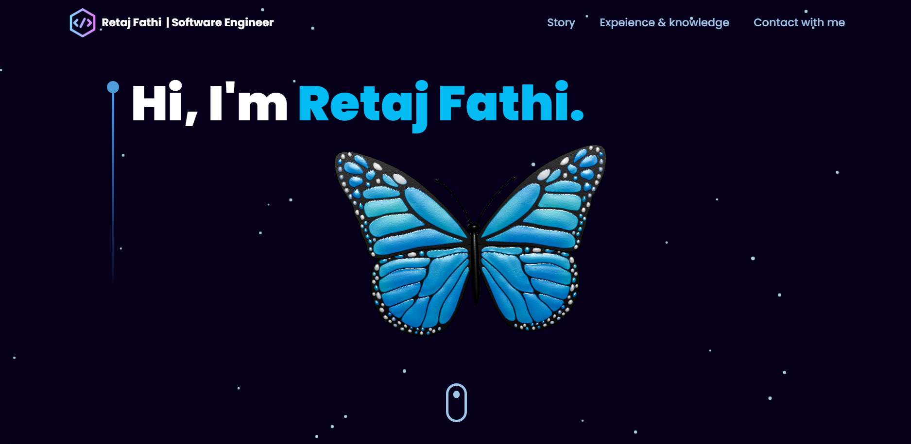
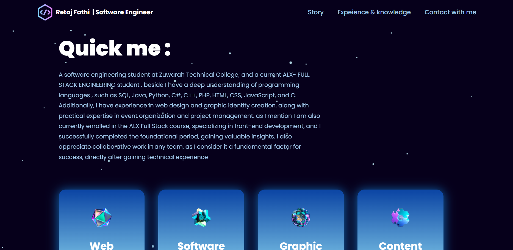
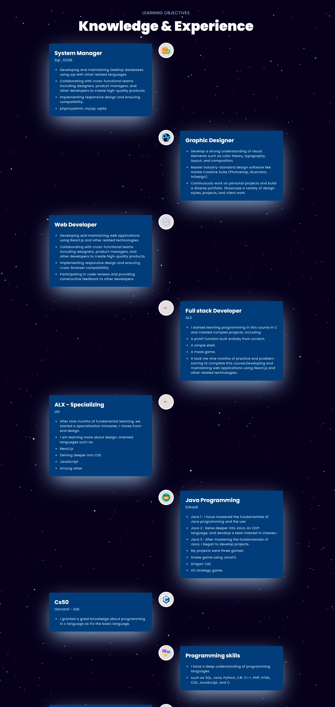
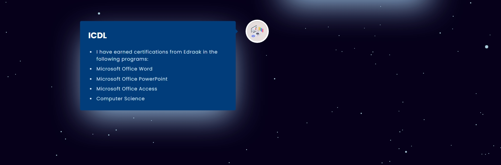
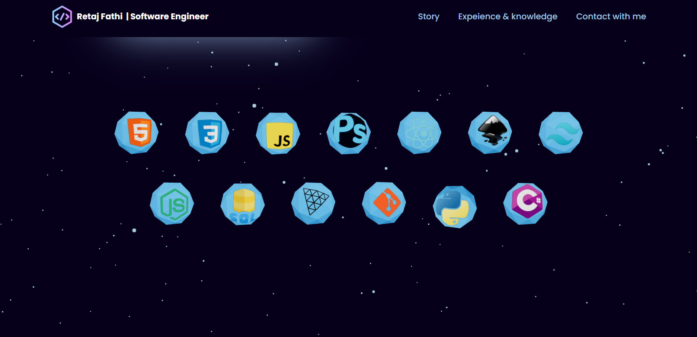
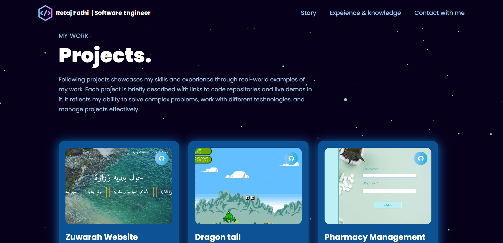
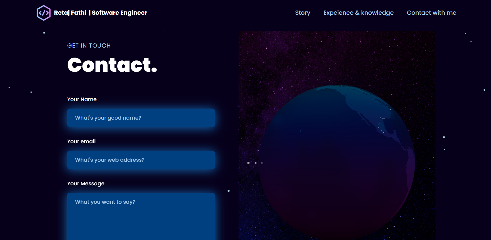

https://github.com/user-attachments/assets/baff4cf8-ffc6-40ab-a91a-81dfb8f7e2d1

# Portfolio Project
<table>
<tr>
<td>
  A portfolio project is a website that describes my passion , experience , and character . as a front-end student in alx i facused in designing tools and used html , css , js, react.js , and to challenge my self i add 3d models which i used three.js to control.
</td>
</tr>
</table>

## Demo
Here is a working live demo :  https://youtu.be/v_vvvfJoXh4

### Landing Page

### “Exploring the Cosmos: My Portfolio Project”

A portfolio project serves as a window into my world—a canvas where I express my passion, showcase my experience, and reveal my character. As a front-end student at ALX, I immersed myself in the art of design, wielding HTML, CSS, and JavaScript. React.js became my trusted companion, empowering me to craft dynamic and responsive interfaces.

But I craved more—a touch of magic that would elevate my project beyond the ordinary. So, I delved into the third dimension. Enter Three.js—an enchanting library that allowed me to breathe life into 3D models. The theme? The boundless blue expanse of space. Picture it: a butterfly, delicate yet determined, fluttering at the project’s inception. It challenged the very atmosphere, defying gravity, and soared upward.

Studying at ALX-SE revealed a profound truth: Some things defy imagination in the physical realm, yet we can conjure them within the confines of our laptops and through our programming prowess. The harder the challenge, the higher we ascend—the vastness of space awaiting our exploration.

## Landing :

## About me section :

## Experience section:

## Technologies section:

## Projects section :

## Contact section :

## Built with 

    

## To-do
- Add a page for every single project .
- create 3d models to emulate my projects.

## Team

- it's just me ^-^ , worked solo in this project .
- Retaj Fathi .

https://github.com/user-attachments/assets/556dbcc1-8809-4bdb-850b-a9dcdb6dee06

